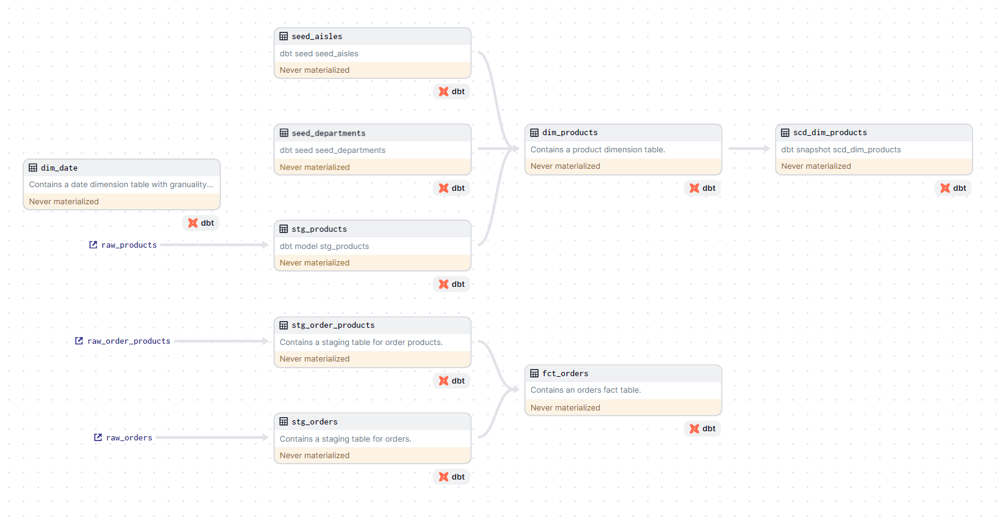

# ETL Pipeline for Instacart Dataset
This project facilitates the extraction, transformation, and loading of data from the Instacart dataset. The ETL pipeline is orchestrated using DBT and Dagster, with Snowflake as the data warehouse.

#### Used libraries and tools
[![Snowflake][Snowflake]][Snowflake-url] [![DBT][DBT]][DBT-url] [![Dagster][Dagster]][Dagster-url] [![ADLS][ADLS]][ADLS-url]

## DBT transformations
In order to create star schema, the following transformations are applied using DBT:

A date dimension table is created using the dbt_date package. Two seed files are created for departments and aisles tables. Source files for the rest of the tables are queried from the Snowflake database.

## Project structure
The workspace contains two main modules related to DBT and Dagster: dbt_orders and dbt_dagster. Each serves a distinct purpose in orchestrating and executing data transformations and orchestrations within a data engineering pipeline, leveraging DBT for transformations and Dagster for workflow orchestration.

### dbt_orders
The dbt_orders module is primarily focused on defining and executing data transformations using DBT (Data Build Tool). This module structures the transformations necessary to create a star schema from the Instacart dataset, with a focus on creating dimension tables and applying transformations to source data stored in Snowflake.

Key components of the dbt_orders module include:

Models: SQL files defining transformations to create tables in Snowflake. Examples include dimension tables like dim_date and dim_products, and staging tables like stg_orders and stg_products. Expectations are also defined in these models to ensure data quality.
Seeds: CSV files used to load static data into Snowflake tables, such as seed_aisles.csv and seed_departments.csv.
Fact table is processed incrementally. Changes in dimension tables are tracked using type 2 slowly changing dimension.

### dbt_dagster
The dbt_dagster module integrates DBT with Dagster, an orchestration tool, to manage the execution of DBT models and tests within a pipeline. This module defines Dagster assets and jobs to automate the running of DBT commands and to ensure that data transformations are executed in a controlled and reliable manner.

Key components of the dbt_dagster module include:

Assets: Definitions of DBT models and tests as Dagster assets, allowing for the orchestration of DBT commands within a Dagster pipeline.
Jobs: Dagster jobs that execute DBT commands, such as running DBT models and tests, to ensure that data transformations are executed successfully.
Schedules: Configuration of schedules for running Dagster jobs at specified intervals, enabling automated data transformation processes.

## References
The dataset used in this project is from Instacart. The dataset is available at the following link: [Instacart Online Grocery Shopping Dataset 2017](https://www.instacart.com/datasets/grocery-shopping-2017) and [Kaggle](https://www.kaggle.com/c/instacart-market-basket-analysis/data?select=departments.csv.zip)

<!-- MARKDOWN LINKS & IMAGES -->
[Snowflake]: https://img.shields.io/badge/Snowflake-000000?style=for-the-badge&logo=snowflake
[Snowflake-url]: https://www.snowflake.com/

[DBT]: https://img.shields.io/badge/DBT-000000?style=for-the-badge&logo=dbt
[DBT-url]: https://www.getdbt.com/

[Dagster]: https://img.shields.io/badge/Dagster-000000?style=for-the-badge&logo=dagster
[Dagster-url]: https://dagster.io/

[ADLS]: https://img.shields.io/badge/Azure%20Data%20Lake%20Storage-000000?style=for-the-badge&logo=microsoft-azure
[ADLS-url]: https://azure.microsoft.com/en-us/services/storage/data-lake-storage/